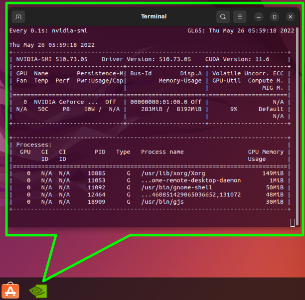

# Ubuntu Gnome Dock Launcher for NVIDIA-SMI

### What is this ?
* A launcher for the NVIDIA System Management Interface (SMI) that can be used through the Ubuntu Gnome dock.

* Intended to be used as a convenience, instead of typing the "watch -n0.1 nvidia-smi" in a terminal, every time you want to monitor the status of your Nvidia graphics card (e.g., VRAM and GPU utilization while training deep learning models).

* Tested with Ubuntu 22.04.

### Installation:

* chmod +x install_nvidia_smi_launcher.sh
* sudo --preserve-env=HOME ./install_nvidia_smi_launcher.sh 

### Removal:
* chmod +x uninstal_nvidia_smi_launcher.sh
* sudo --preserve-env=HOME ./uninstal_nvidia_smi_launcher.sh 
